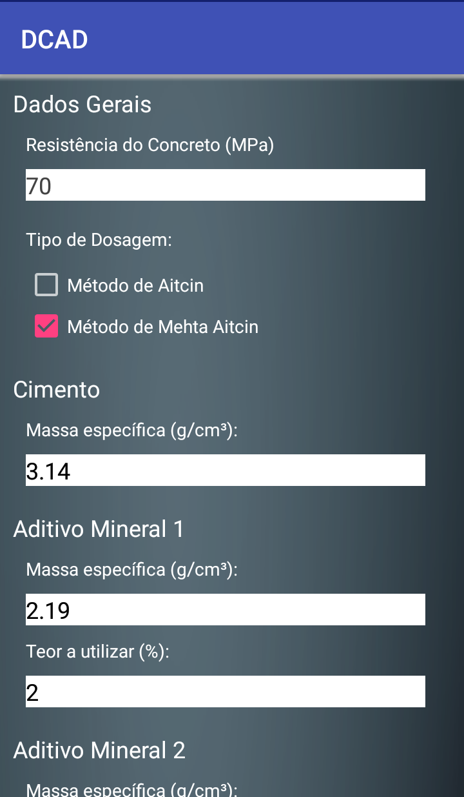
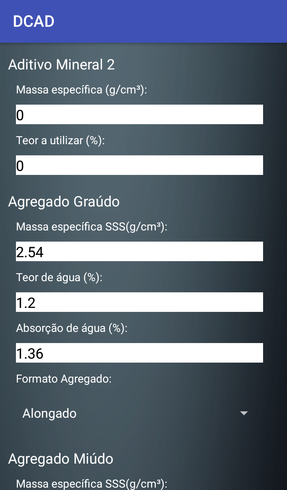
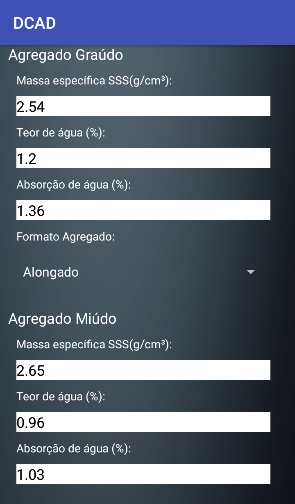
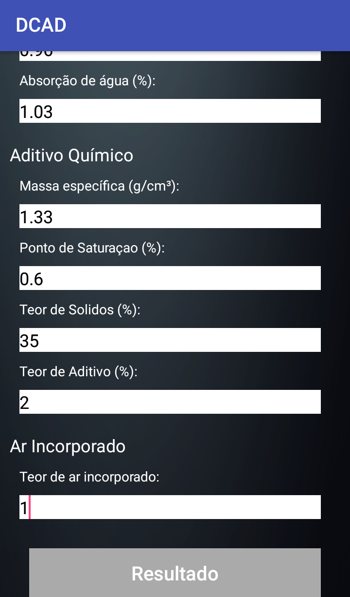
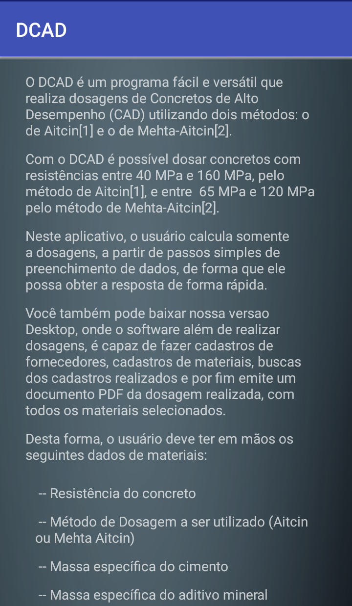

# DCAD Desktop Version 1.0

## Introduction

DCAD is a app for Android. "Dosagem de Concreto de Alto Desempenho", the name in Portuguese, this app presents a dosage for a High Performance Concrete (HPC) based on the characteristics of the materials and the method choose for the user. DCAD only needs material's characteristics to calculate the dosage.

## Software DCAD

The software starts with a principal window, where it is possible to see some operations in their menu. There are 4 buttons: "Nova Dosagem" (new dosage), "Sobre os Materiais" (about the materials), "Utilizando o Aplicativo" (using app), "Sobre o Aplicativo" (about the app) and "Sair" (exit).

 <b>Figure 1:</b> DCAD - Principal Window

"Nova Dosagem" (new dosagem) is the principal steep. The App open a new window with some informations to complete about the materials (you can see this characteristics in description in [https://github.com/AnaWaldila/dcad] and read more in Reis et al (2016). All informations are present in Figures 2:

 <b>Figure 2:</b> DCAD - Dosage Window

Finally, press button "Resultado" (result) and a new window is opened, Figure 3. In this window, the user needs to insert the volume of concrete that wants, in "Volume de Concreto (m³)" (concrete volume, m³). After insert this information, only click in button "Calcular" (calculate) and the column is completed.

 <b>Figure 3:</b> DCAD - Result Window

Button "Sobre os Materiais" (about the materials) and "Utilizando o Aplicativo" (using app) show a simple help to user about all materiais that are necessaire to input data to calculate the dosage, like Figure 4.

 <b>Figure 13:</b> DCAD - About Material Window and Using App Window

Finally, the last button "Sobre o Aplicativo" (about the app), show a informations about the institution and developers.

 <b>Figure 15:</b> DCAD - About the App Window

DCAD software has a Brazilian Registration in INPI (Instituto Nacional de Propriedade Industrial) and the registration number is BR 51 2016 000973-0.

## Informations About the Software

Rio de Janeiro State University

Faculty of Engineering

Developer: Ana Waldila de Queiroz Ramiro Reis 

Professors: Margareth da Silva Magalhães and Rodrigo Bird Burgos

Contact: anawaldila@hotmail.com

Link for download: https://play.google.com/store/apps/details?id=uerj.dcad
