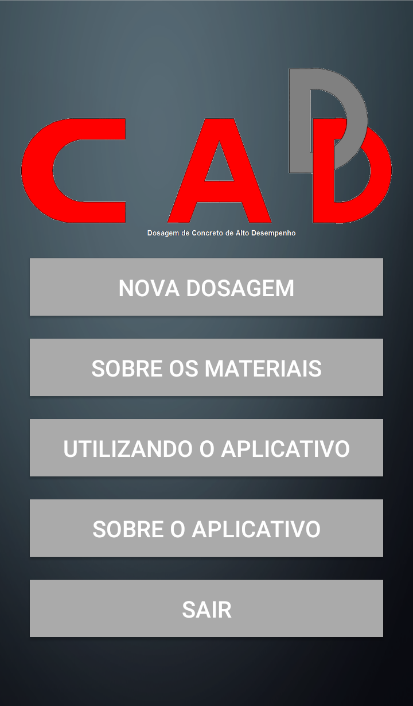
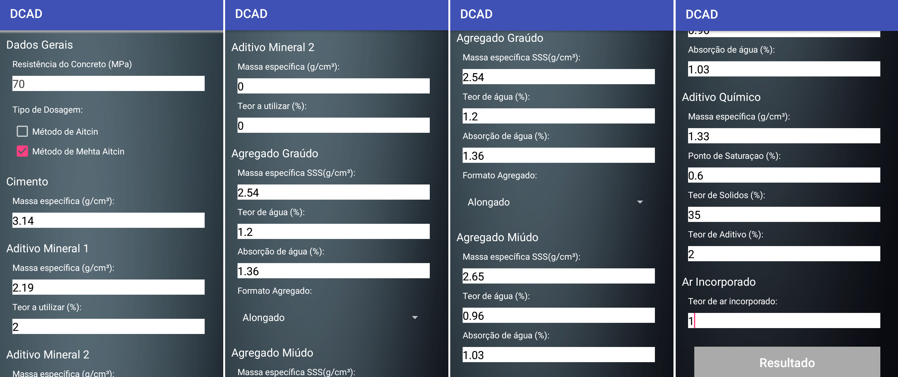
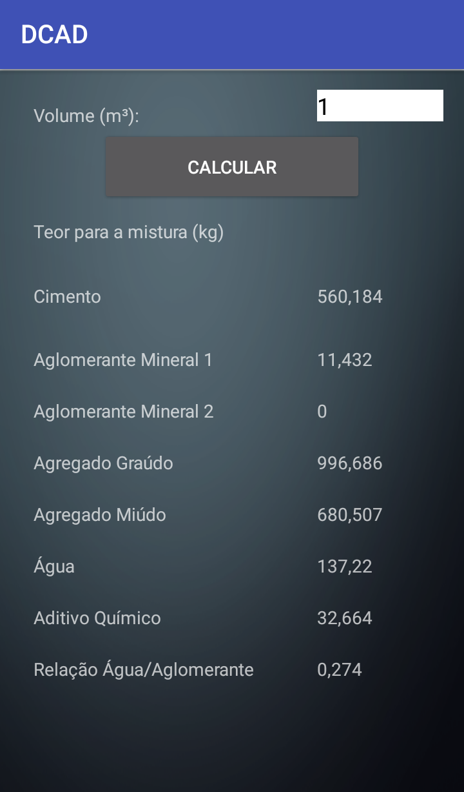
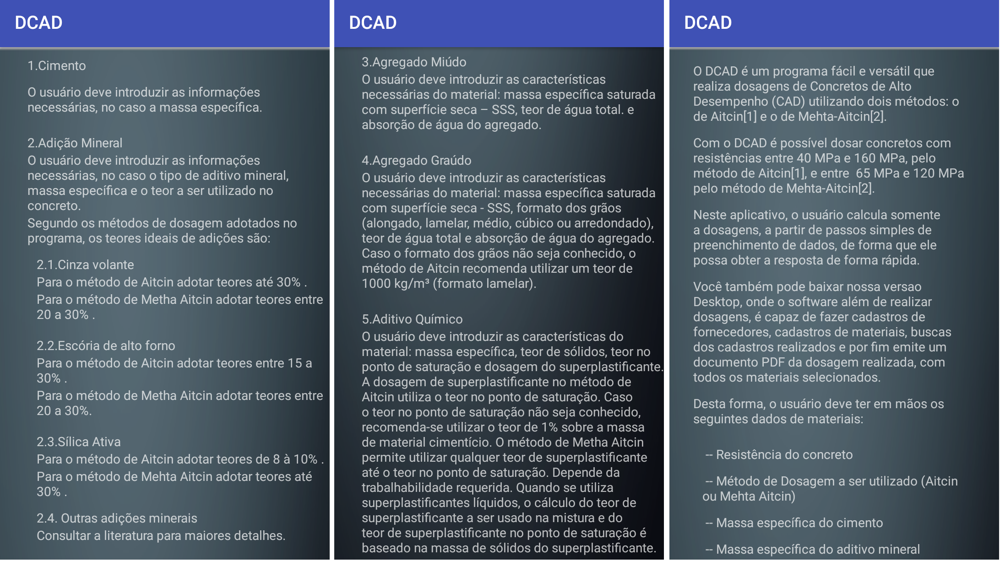
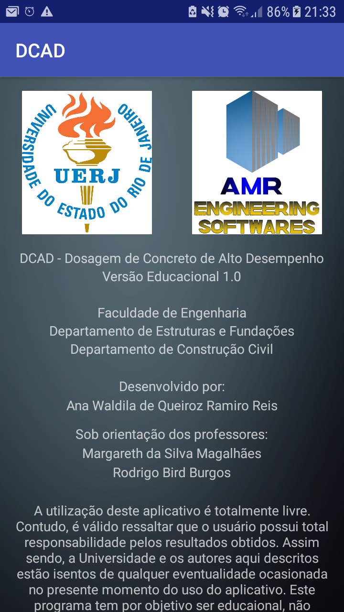

# DCAD App Version 1.0

## Introduction

DCAD is an Android application. "Dosagem de Concreto de Alto Desempenho" (or Dosage of High Performance Concrete), this app calculate a dosage for a High Performance Concrete (HPC) based on the characteristics of the materials and the method chosen by the user. 

## Software DCAD

The software starts with a main window, which the user can preview some operations in its menu. There are 4 buttons: "Nova Dosagem" (New dosage), "Sobre os Materiais" (About materials), "Utilizando o Aplicativo" (Using the app), "Sobre o Aplicativo" (about the app) and "Sair" (exit).

 <b>Figure 1:</b> DCAD - Principal Window

"New Dosage" is the main steep. The DCAD App opens a new window with some pieces of information to complete about the materials, as possible to observe these characteristics in the description at [https://github.com/AnaWaldila/dcad] and read more in Reis et al (2016). All information are present in Figures 2:

 <b>Figure 2:</b> DCAD - Dosage Window

Finally, press the button "Result" (result) and a new window opens, as shown in Figure 3. In this window, the user needs to enter the volume of concrete, in "Volume de concreto (m³)" (volume of concrete, m³). After insert this information, just click the "Calcular" button (calculate) and the column is completed.

 <b>Figure 3:</b> DCAD - Result Window

The buttons "Sobre os Materiais" (about the materials) and "Utilizando o Aplicativo" (using the app) show a simple help to the user about all the materials needed to enter data to calculate the dosage, as shown in Figure 4.

 <b>Figure 4:</b> DCAD - About Material Window and Using App Window

Finally, the last button "Sobre o Aplicativo" (about the app), shows information about the institution and the developers.

 <b>Figure 5:</b> DCAD - About the App

DCAD software has a Brazilian Registration in INPI (Instituto Nacional de Propriedade Industrial) and the registration number is BR 51 2016 000973-0.

## References

REIS, A. W. Q. R.; MAGALHAES, M. S. ; BURGOS, R. B. . Dosagem de Concretos de Alto Desempenho Utilizando a Ferramenta Computacional DCAD. SODEBRÁS, v. 135, p. 176-181, 2017.

REIS, A. W. Q. R.; MAGALHAES, M. S. ; BURGOS, R. B. . Desenvolvimento de um Software para Dosagem de CAD. REVISTA INTERDISCIPLINAR DE PESQUISA EM ENGENHARIA, v. 2, p. 251-268, 2016.

REIS, A. W. Q. R.; MAGALHAES, M. S. ; BURGOS, R. B. . DCAD - Aplicativo para Celular Android como Ferramenta para Dosagem de Concreto de Alto Desempenho. In: 59º Congresso Brasileiro do Concreto - CBC 2017, 2017, Bento Gonçalves - RS. Anais do 59º Congresso Brasileiro do Concreto - CBC 2017, 2017.

REIS, A. W. Q. R.; MAGALHAES, M. S. ; OHNUMA JUNIOR, A. A. . Dosagem de Concretos de Alto Desempenho Utilizando a Ferramenta Computacional DCAD. In: XXXVI INTERNATIONAL SODEBRAS CONGRESS, 2016, Belo Horizonte. XXXVI INTERNATIONAL SODEBRAS CONGRESS, 2016.

REIS, A. W. Q. R.; MAGALHAES, M. S. ; BURGOS, R. B. . Desenvolvimento de um Software para Dosagem de CAD. In: CILAMCE 2016 - XXXVII Ibero-Latin American Congress on Computational Methods in Engineering, 2016, Brasília. CILAMCE 2016 - Proceedings, 2016. v. 1. p. 1.

## Information About the Software

Rio de Janeiro State University

Faculty of Engineering

Developer: Ana Waldila de Queiroz Ramiro Reis 

Professors: Margareth da Silva Magalhães and Rodrigo Bird Burgos

Contact: anawaldila@hotmail.com
